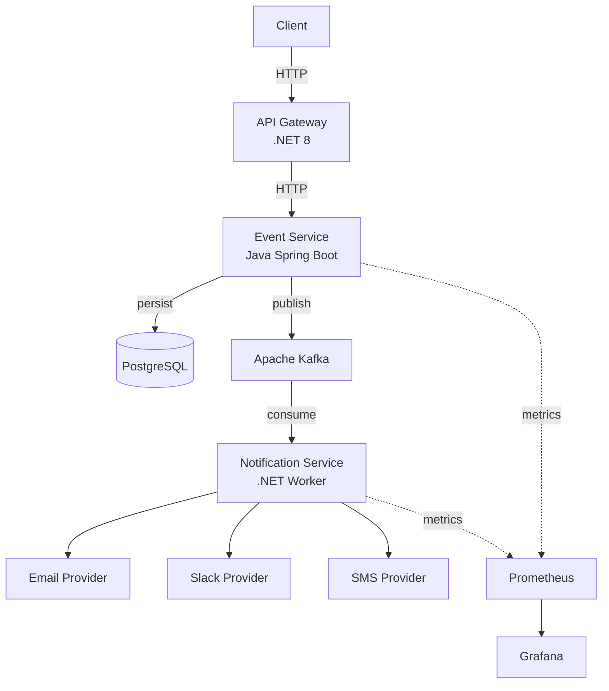
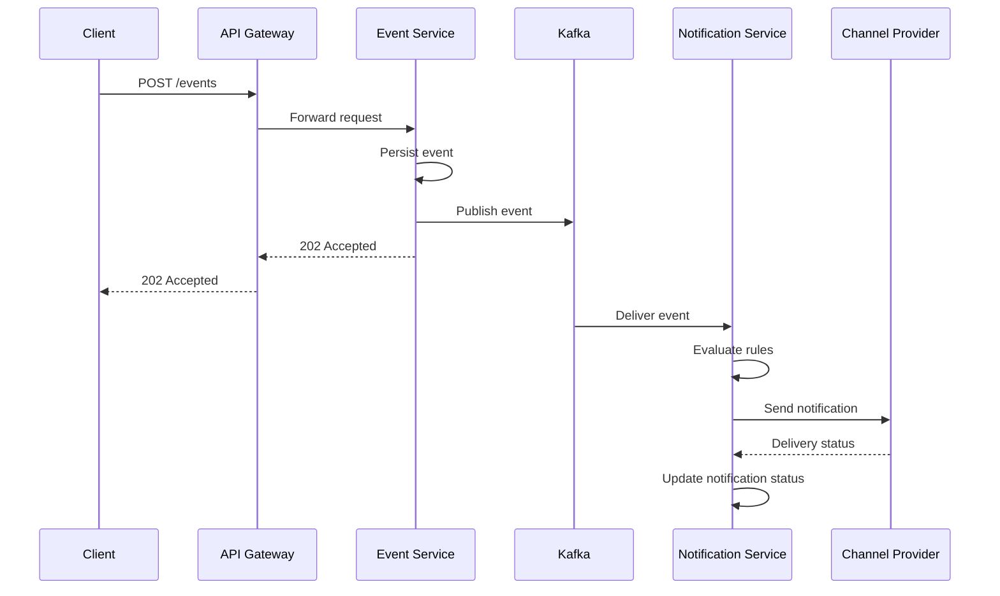

# 📐 UML Diagrams

## 1. Component Diagram

Shows the main system components and their relationships.

```
┌─────────────────────────────────────────────────────────────┐
│                    «system»                                 │
│          Distributed Notification Platform                   │
│                                                             │
│  ┌─────────────┐     ┌──────────────┐     ┌──────────────┐ │
│  │   «component»│     │  «component» │     │  «component» │ │
│  │  API Gateway │────▶│ Event Service│────▶│   Message    │ │
│  │   (.NET 8)  │ HTTP│ (Java/Spring)│ pub │   Broker     │ │
│  └─────────────┘     └──────┬───────┘     │   (Kafka)    │ │
│                             │             └──────┬───────┘ │
│                             │ persist            │ consume  │
│                             ▼                    ▼         │
│                     ┌──────────────┐     ┌──────────────┐  │
│                     │  «component» │     │  «component» │  │
│                     │  PostgreSQL  │     │ Notification │  │
│                     │  Database    │     │  Service     │  │
│                     └──────────────┘     │  (.NET 8)    │  │
│                                          └──┬───┬───┬──┘  │
│                                             │   │   │      │
│                                          ┌──▼─┐ │ ┌─▼──┐  │
│                                          │Email│ │ │SMS │  │
│                                          └────┘ │ └────┘  │
│                                             ┌───▼──┐      │
│                                             │Slack │      │
│                                             └──────┘      │
└─────────────────────────────────────────────────────────────┘
```

---

## 2. Sequence Diagram — User Registration Flow

Shows the full lifecycle of a `USER_REGISTERED` event.

```
┌──────┐    ┌───────────┐    ┌─────────────┐    ┌───────┐    ┌──────────────┐    ┌───────┐
│Client│    │API Gateway│    │Event Service │    │ Kafka │    │Notification  │    │ Email │
│      │    │  (.NET)   │    │   (Java)     │    │       │    │Service (.NET)│    │Provider│
└──┬───┘    └─────┬─────┘    └──────┬───────┘    └───┬───┘    └──────┬───────┘    └───┬───┘
   │              │                 │                │               │                │
   │ POST /events │                 │                │               │                │
   │─────────────▶│                 │                │               │                │
   │              │                 │                │               │                │
   │              │ Forward request │                │               │                │
   │              │────────────────▶│                │               │                │
   │              │                 │                │               │                │
   │              │                 │ Persist event  │               │                │
   │              │                 │───┐            │               │                │
   │              │                 │   │ PostgreSQL │               │                │
   │              │                 │◀──┘            │               │                │
   │              │                 │                │               │                │
   │              │                 │ Publish event  │               │                │
   │              │                 │───────────────▶│               │                │
   │              │                 │                │               │                │
   │              │   202 Accepted  │                │               │                │
   │              │◀────────────────│                │               │                │
   │              │                 │                │               │                │
   │ 202 Accepted │                 │                │               │                │
   │◀─────────────│                 │                │               │                │
   │              │                 │                │               │                │
   │              │                 │                │ Consume event │                │
   │              │                 │                │──────────────▶│                │
   │              │                 │                │               │                │
   │              │                 │                │               │ Evaluate rules │
   │              │                 │                │               │───┐            │
   │              │                 │                │               │   │ Rule Engine│
   │              │                 │                │               │◀──┘            │
   │              │                 │                │               │                │
   │              │                 │                │               │ Send email     │
   │              │                 │                │               │───────────────▶│
   │              │                 │                │               │                │
   │              │                 │                │               │     Success    │
   │              │                 │                │               │◀───────────────│
   │              │                 │                │               │                │
   │              │                 │                │               │ Update status  │
   │              │                 │                │               │───┐            │
   │              │                 │                │               │   │ SENT       │
   │              │                 │                │               │◀──┘            │
```

---

## 3. Sequence Diagram — Payment Failed Flow

Shows how a `PAYMENT_FAILED` event triggers a Slack alert.

```
┌──────┐    ┌───────────┐    ┌─────────────┐    ┌───────┐    ┌──────────────┐    ┌───────┐
│Client│    │API Gateway│    │Event Service │    │ Kafka │    │Notification  │    │ Slack │
│      │    │  (.NET)   │    │   (Java)     │    │       │    │Service (.NET)│    │Provider│
└──┬───┘    └─────┬─────┘    └──────┬───────┘    └───┬───┘    └──────┬───────┘    └───┬───┘
   │              │                 │                │               │                │
   │ POST /events │                 │                │               │                │
   │ PAYMENT_FAILED                 │                │               │                │
   │─────────────▶│                 │                │               │                │
   │              │────────────────▶│                │               │                │
   │              │                 │──── persist ──▶│               │                │
   │              │                 │───── publish ─▶│               │                │
   │              │◀────────────────│                │               │                │
   │◀─────────────│                 │                │──── consume ─▶│                │
   │              │                 │                │               │── evaluate ──┐ │
   │              │                 │                │               │◀─────────────┘ │
   │              │                 │                │               │ Slack alert    │
   │              │                 │                │               │───────────────▶│
   │              │                 │                │               │◀───────────────│
```

---

## 4. Class Diagram — Notification Service (Clean Architecture)

```
┌─────────────────────────────────────────────────────────┐
│                      «Domain»                           │
│                                                         │
│  ┌───────────────────┐    ┌──────────────────────────┐  │
│  │   Notification     │    │   NotificationRule       │  │
│  ├───────────────────┤    ├──────────────────────────┤  │
│  │ + Id: Guid        │    │ + EventType: string      │  │
│  │ + EventId: Guid   │    │ + Channel: ChannelType   │  │
│  │ + Channel: enum   │    │ + Template: string       │  │
│  │ + Recipient: str  │    └──────────────────────────┘  │
│  │ + Status: enum    │                                  │
│  │ + SentAt: DateTime│    ┌──────────────────────────┐  │
│  └───────────────────┘    │    «enumeration»         │  │
│                           │    ChannelType           │  │
│                           ├──────────────────────────┤  │
│                           │  EMAIL                   │  │
│                           │  SLACK                   │  │
│                           │  SMS                     │  │
│                           └──────────────────────────┘  │
│                                                         │
│                           ┌──────────────────────────┐  │
│                           │    «enumeration»         │  │
│                           │  NotificationStatus      │  │
│                           ├──────────────────────────┤  │
│                           │  PENDING                 │  │
│                           │  SENT                    │  │
│                           │  FAILED                  │  │
│                           │  RETRYING                │  │
│                           └──────────────────────────┘  │
└─────────────────────────────────────────────────────────┘

┌─────────────────────────────────────────────────────────┐
│                    «Application»                        │
│                                                         │
│  ┌───────────────────────────┐                          │
│  │  «interface»              │                          │
│  │  INotificationSender      │                          │
│  ├───────────────────────────┤                          │
│  │ + SendAsync(notification) │                          │
│  └───────────────────────────┘                          │
│                                                         │
│  ┌───────────────────────────┐                          │
│  │  «interface»              │                          │
│  │  IRuleEngine              │                          │
│  ├───────────────────────────┤                          │
│  │ + Evaluate(event): Rule   │                          │
│  └───────────────────────────┘                          │
│                                                         │
│  ┌───────────────────────────┐                          │
│  │  ProcessEventUseCase      │                          │
│  ├───────────────────────────┤                          │
│  │ - ruleEngine: IRuleEngine │                          │
│  │ - sender: INotifSender    │                          │
│  ├───────────────────────────┤                          │
│  │ + ExecuteAsync(event)     │                          │
│  └───────────────────────────┘                          │
└─────────────────────────────────────────────────────────┘

┌─────────────────────────────────────────────────────────┐
│                   «Infrastructure»                      │
│                                                         │
│  ┌───────────────────┐  ┌──────────────────────┐       │
│  │  EmailProvider     │  │  SlackProvider       │       │
│  │  : INotifSender    │  │  : INotifSender      │       │
│  └───────────────────┘  └──────────────────────┘       │
│                                                         │
│  ┌───────────────────┐  ┌──────────────────────┐       │
│  │  SmsProvider       │  │  KafkaConsumer       │       │
│  │  : INotifSender    │  │  : BackgroundService │       │
│  └───────────────────┘  └──────────────────────┘       │
└─────────────────────────────────────────────────────────┘
```

---

## 5. Activity Diagram — Event Processing

```
                    ┌─────────┐
                    │  Start  │
                    └────┬────┘
                         │
                         ▼
                ┌────────────────┐
                │ Receive Event  │
                │  from Kafka    │
                └───────┬────────┘
                        │
                        ▼
                ┌────────────────┐
                │ Deserialize    │
                │ Event Payload  │
                └───────┬────────┘
                        │
                        ▼
                ┌────────────────┐     No     ┌─────────────┐
                │  Valid Event?  │────────────▶│  Log & Skip │
                └───────┬────────┘            └──────┬──────┘
                        │ Yes                        │
                        ▼                            ▼
                ┌────────────────┐            ┌─────────┐
                │ Evaluate Rules │            │  End    │
                └───────┬────────┘            └─────────┘
                        │
                        ▼
                ┌────────────────┐     No     ┌─────────────┐
                │  Rule Found?   │────────────▶│ Log Warning │
                └───────┬────────┘            └──────┬──────┘
                        │ Yes                        │
                        ▼                            ▼
                ┌────────────────┐            ┌─────────┐
                │Create Notif.   │            │  End    │
                │ (PENDING)      │            └─────────┘
                └───────┬────────┘
                        │
                        ▼
                ┌────────────────┐
                │ Send via       │
                │ Channel        │
                └───────┬────────┘
                        │
                ┌───────┴────────┐
                │                │
             Success          Failure
                │                │
                ▼                ▼
        ┌──────────┐    ┌──────────────┐
        │ Status:  │    │  Status:     │
        │  SENT    │    │  FAILED      │
        └────┬─────┘    └──────┬───────┘
             │                 │
             ▼                 ▼
        ┌─────────┐     ┌─────────┐
        │  End    │     │  End    │
        └─────────┘     └─────────┘
```

---

## 6. Deployment Diagram

```
┌─────────────────────────────────────────────────────┐
│                  «Docker Host»                      │
│                  (Docker Compose)                    │
│                                                     │
│  ┌──────────┐  ┌──────────┐  ┌──────────────────┐  │
│  │api-gateway│  │event-svc │  │notification-svc  │  │
│  │  :5000    │  │  :8080   │  │  (worker)        │  │
│  │  .NET 8   │  │Java 21   │  │  .NET 8          │  │
│  └──────────┘  └──────────┘  └──────────────────┘  │
│                                                     │
│  ┌──────────┐  ┌──────────┐  ┌──────────────────┐  │
│  │ postgres │  │  kafka   │  │   zookeeper      │  │
│  │  :5432   │  │  :9092   │  │   :2181          │  │
│  └──────────┘  └──────────┘  └──────────────────┘  │
│                                                     │
│  ┌──────────┐  ┌──────────┐                         │
│  │prometheus│  │ grafana  │                         │
│  │  :9090   │  │  :3000   │                         │
│  └──────────┘  └──────────┘                         │
└─────────────────────────────────────────────────────┘
```

---

## Mermaid Diagrams (GitHub Renderable)

The following Mermaid diagrams can be rendered directly by GitHub.

### Component Diagram (Mermaid)



### Sequence Diagram (Mermaid)


